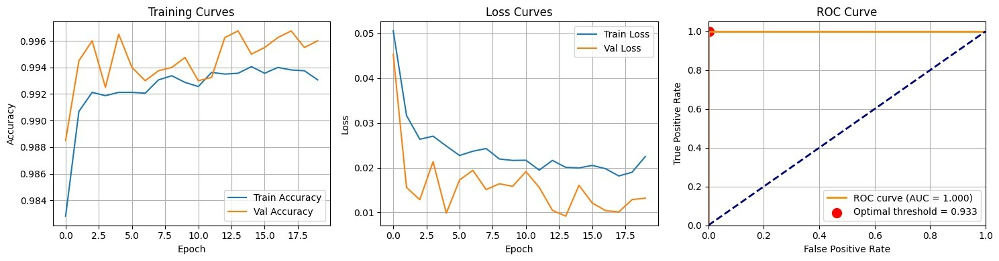

# Concrete Crack Detection System

A CNN-based binary image classification system that detects cracks in concrete surfaces using MobileNetV2 and TensorFlow. Trained on 40,000 augmented images with 99.5% validation accuracy.

**Live Demo:** [Concrete Crack Detection v2 on Streamlit](https://crackdetectionapp-lbbvqkcubbbkwgkppjtbck.streamlit.app/)

---

## 📋 Overview

This project classifies images of concrete surfaces as either:
- **Crack Detected** ⚠️ — Structural damage identified
- **No Crack** ✅ — Pristine surface

The model is deployed as an interactive web application using Streamlit for easy real-time predictions.

---

## 🏗️ Tech Stack

- **Python 3.11+**
- **TensorFlow/Keras** — Deep learning framework
- **MobileNetV2** — Pretrained CNN architecture (ImageNet weights)
- **Streamlit** — Web app framework
- **NumPy, Pillow** — Image processing

---

## 📊 Model Performance

### Performance Metrics

| Metric | Value |
|--------|-------|
| Training Data | 40,000 images (20,000 cracked + 20,000 normal) |
| Architecture | MobileNetV2 + custom classification head |
| Training Epochs | 20 |
| Validation Accuracy | 99.5% |
| Precision | 0.99 |
| Recall | 0.99 |
| F1-Score | 0.99 |
| ROC-AUC | 1.00 |
| Decision Threshold | 0.9334 (optimized via ROC curve) |

### Training & Validation Curves



### Data Augmentation Applied
- Rotation (±40°)
- Horizontal/vertical flips
- Brightness variation (0.7x - 1.3x)
- Zoom (±20%)
- Width/height shifts (±20%)

---

## 🚀 Deployment

The model is deployed on **Streamlit Cloud** at:
```
https://crackdetectionapp-lbbvqkcubbbkwgkppjtbck.streamlit.app/
```

Simply upload an image and get instant crack detection with confidence scores.

---

## 📁 Files

```
concrete-crack-detection/
├── app.py                              # Streamlit web application
├── crack_detection_model_v2.keras      # Trained model (11MB)
├── optimal_threshold.npy               # Optimal decision threshold
├── requirements.txt                    # Python dependencies
├── training_curves.png                 # Training/validation curves
└── README.md                           # This file
```

---

## 🏃 Quick Start

### Running Locally

1. **Clone the repo:**
   ```bash
   git clone https://github.com/topegramms/concrete-crack-detection.git
   cd concrete-crack-detection
   ```

2. **Install dependencies:**
   ```bash
   pip install -r requirements.txt
   ```

3. **Run the app:**
   ```bash
   streamlit run app.py
   ```

4. **Open in browser:**
   ```
   http://localhost:8501
   ```

### Using the Web App

1. Go to the [live demo](https://concrete-crack-detection.streamlit.app)
2. Upload a concrete surface image (JPG, JPEG, or PNG)
3. Get instant classification + confidence score

---

## 📷 Example Usage

**Input:** Concrete surface image (224×224 pixels)
```
[Concrete with diagonal crack]
```

**Output:**
```
⚠️ CRACK DETECTED
Confidence: 95.32%
Raw Score: 0.9532
```

---

## 🔬 Dataset

- **Source:** [Concrete Crack Images for Classification](https://www.kaggle.com/datasets/arnavr10880/concrete-crack-images-for-classification) (Kaggle)
- **Total Images:** 40,000 (20,000 cracked, 20,000 non-cracked)
- **Image Size:** 227×227 pixels (resized to 224×224 for model)
- **Format:** JPEG

---

## 🛠️ Model Architecture

```
Input (224×224×3)
    ↓
MobileNetV2 (frozen base, ImageNet weights)
    ↓
GlobalAveragePooling2D()
    ↓
Dropout(0.3)
    ↓
Dense(128, ReLU)
    ↓
Dropout(0.3)
    ↓
Dense(1, Sigmoid)
    ↓
Output (0.0 - 1.0) — Probability of crack
```

---

## 📈 Training Details

- **Optimizer:** Adam (lr=0.001)
- **Loss Function:** Binary Cross-Entropy
- **Batch Size:** 32
- **Validation Split:** 80/20 train/validation
- **Training Duration:** ~2.5 hours (T4 GPU, Google Colab)

### Training History


---

## ⚠️ Known Limitations

1. **Binary classification only** — Does not grade crack severity (mild/moderate/severe)
2. **Limited to frontal images** — Works best on perpendicular, well-lit concrete surfaces
3. **No localization** — Does not identify crack location within image
4. **224×224 resolution** — Small details may be lost during preprocessing

---

## 🔮 Future Improvements

- [ ] Multi-class classification for crack severity grading
- [ ] Crack localization using object detection (YOLO)
- [ ] Quantitative crack width estimation
- [ ] Mobile app deployment
- [ ] Real-time video stream processing
- [ ] Integration with IoT sensors for autonomous monitoring

---

## 📚 Educational Context

This project was developed as a capstone project for the **TechCrush AI/ML Engineering Bootcamp** (5-week program). 

**Supervisor:** Damilare Olagunju

**Key Learning Outcomes:**
- Transfer learning with pretrained models
- Data augmentation strategies
- Threshold optimization via ROC curves
- Streamlit deployment pipeline
- Model evaluation and generalization

---

## 🔗 Links

- **GitHub:** https://github.com/TopeGramms/concrete-crack-detection
- **Dataset:** https://www.kaggle.com/datasets/arnavr10880/concrete-crack-images-for-classification
- **Kaggle Competition:** [Similar models](https://www.kaggle.com/code/angelmm/concrete-crack-detection)

---

## 📝 License

MIT License — See LICENSE file for details

---

## 👤 Author

**Gramms** (@TopeGramms)
- GitHub: [@TopeGramms](https://github.com/TopeGramms)
- Twitter: [@topegramms](https://twitter.com/topegramms)
- Based in Lagos, Nigeria

---

## 📧 Questions?

Open an issue or reach out on [X/Twitter](https://twitter.com/topegramms).
